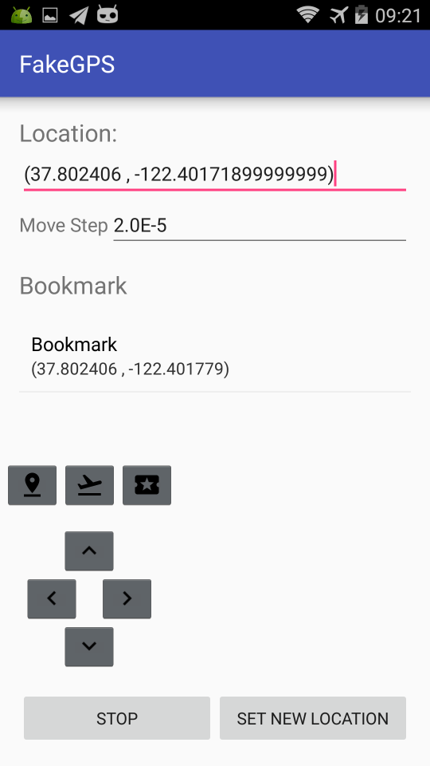
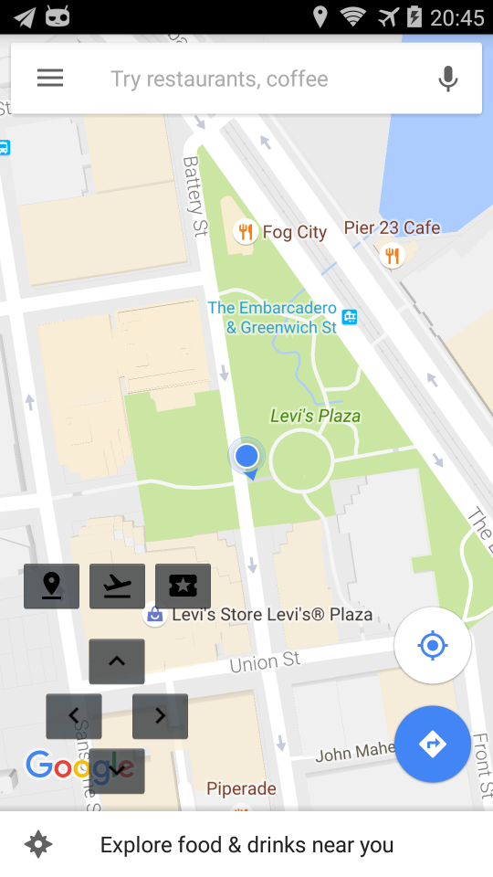

# FakeGPS

### ChangeLog
- 原仓库使用的是`Android Studio 2.x`版本，更新配置文件到`Android Studio 3.1`版本
- 修改Flight Mode功能，可输入经纬度坐标轨迹，按轨迹匀速前进（原来的前进方式是ease-in），并修正了原项目的经纬度插值错误[Pull request#12](https://github.com/xiangtailiang/FakeGPS/pull/12)
- // TODO: Fix->Bearing计算方式有误

### Notice
仓库fork自[@xiangtailiang/FakeGPS](https://github.com/xiangtailiang/FakeGPS)，以及这种解决方案只能在可以关掉GPS Provider的安卓模拟器（比如Genymotion）以及GPS信号很差的地方（比如室内）才能生效，否则地点会跳来跳去，原因可以参考这个[issue#10](https://github.com/xiangtailiang/FakeGPS/issues/10):smile:

---

FakeGPS is a GPS device simulator. GPS location signal keep output according to the given coordinates. By the direction keys on the joystick, the user can simulate walking on the map.

### Features
- Simulate the real GPS devices, output GPS location per second.
- Have two modes to set the new location: **Jump Mode** and **Flight Mode**. **Jump Mode**: jump to the new location in second. **Flight Mode**: fly to the new location according to the given time by linear interpolation.
- With a global floating joystick, the direction button will do a certain offset at the current position (via Move Step, degrees unit). Click to move a step, long press will move continuously.
- Bookmarks support. In the Bookmarks List, tap to use it, long press to Delete.  Long Press Bookmark button on the joystick to copy the current coordinates to the clipboard, make it easy to share it with other people.

### Installation
Since the FakeGPS need the `INSTALL_LOCATION_PROVIDER` permissions, so it need to installed as system app.

1. Root your phone.
2. Download [Lucky Patcher](https: //lucky-patcher.netbew.com/) and install it.  Launch Lucky Patcher and find "Rebuild & Install" at the bottom bar. Locate FakeGPS using the built-in exploerer in Lucky Patcher. Click the apk file and select "Install as a system app"
3. Uncheck "Allow mock location" in Settings > Developer Options. Enable "Location Services" on your device. It is suggested that you choose "Locate by GPS" instead of "Locate by network and GPS".
4. Launch FakeGPS, click Start button, the joystick will be displayed, if not pop up, turn on the applications floating window display authority (especially MIUI and Flyme, permission is off by default), and then Launch the Maps apps (Like Google Map)and check if it work.

### Screenshots

